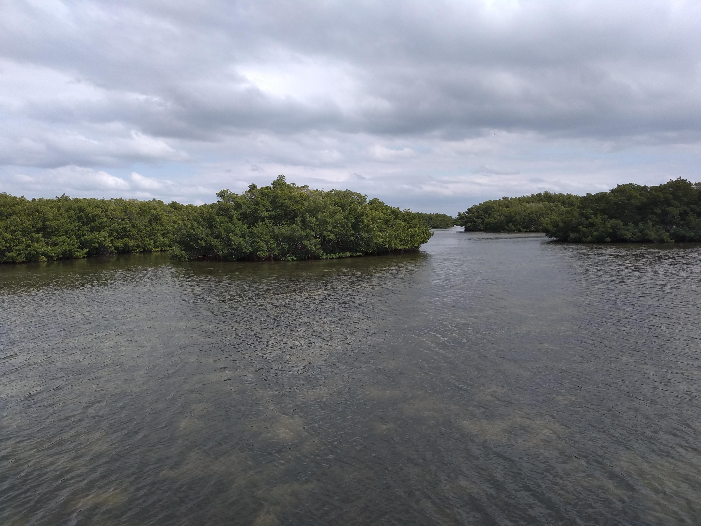
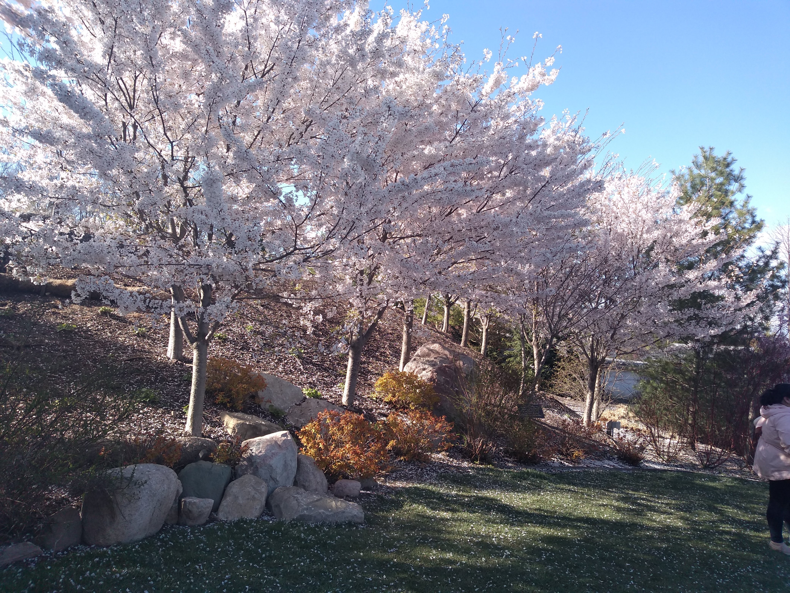
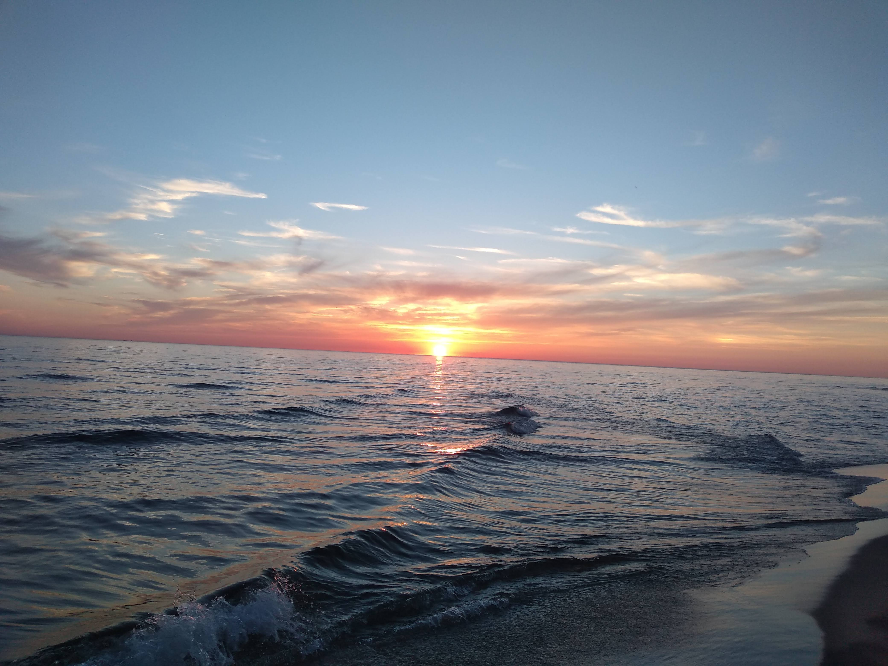
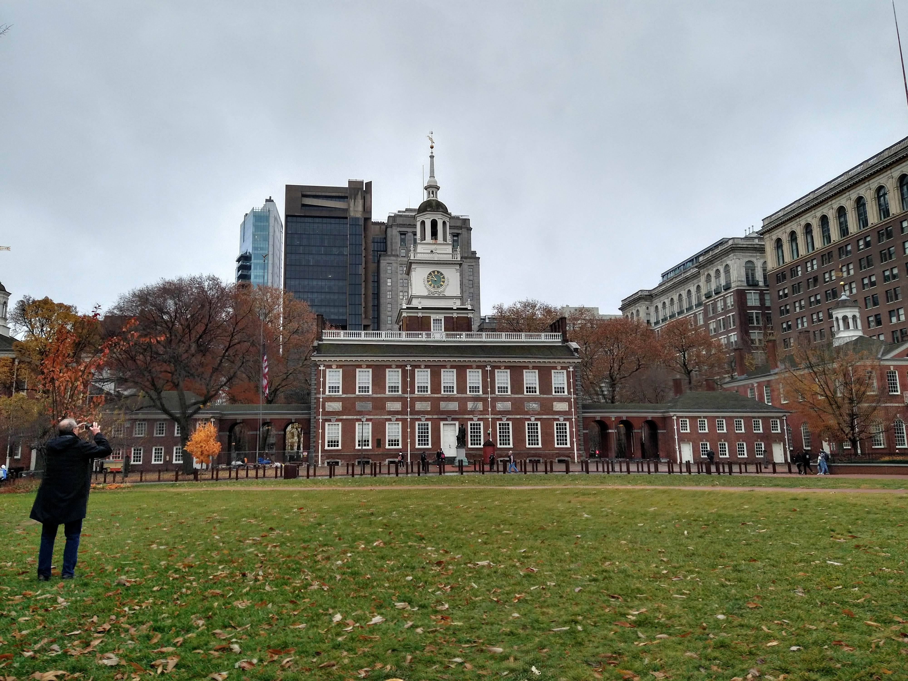

2021 was a promised return to "normalcy" with vaccines, or so many hoped. However, that didn't happen, and we're still having to adjust to life with COVID (but without the safety nets provided in the early phases of the pandemic). Regardless, there was plenty that happened for me that I feel the need to reflect on as we approach the end of the year.

## The Good of 2021

### Buying a House and Moving Closer to Home

If you asked me a year ago if I would have bought a house and took on a mortgage, I wouldn't have believed you. However, a silver lining of remote work is that data analytics jobs don't necessarily need to be done in a specific location, so I was able to leverage that to buy a place that's much closer to where my family is located. 

Although buying a house has more stressors associated with it than renting does, I will say I appreciate the increased space, peace and quiet, and lower cost of living I've been afforded being able to move out of a larger city.

### Making My First Game

As I referenced in a previous post, I made my first game, Edge of Chaos! Now that I have the confidence and learnings of that experience, I look forward to making the game I've always dreamed of over the next few years.

### The Vaccine Making Travel Safer

I had opportunities to travel in 2021, especially with being able to get vaccinated all the way back in January. 

I was able to visit my family in Florida:

Visit Frederick Meijer Garden (highly recommended):

Saw a sunset on Lake Michigan (at the insistence of my coworkers) on the longest day of the year, which given that Michigan is on the edge of Eastern Standard Time, happened at 10 PM:

See stunning landscapes in Sleeping Bear Dunes:

And go to Philadelphia for the first time whilst attending PAX Unplugged:

Overall, my 2021 was WAY more active than 2020.

## The Bad of 2021

### More COVID Troubles

New variants, continued strain on the healthcare system, the politicizing of basic protections against the disease, and burnout are but a few of the problems that we all faced in the continued marathon against COVID-19. Many hospital systems are overrun with the Omicron variant and due to global mismanagement of vaccines, new variants will inevitably crop up going into 2022.

The economic fallout of the pandemic also can't be underestimated. Inflation is at 6.8% in November 2021, the highest it's been in 40 years. (Due to inflation we are also seeing shrinkflation and skimpflation, so that number is probably underestimating its true impact.) To combat inflation, interest rates will have to rise, which may cause yet another stock market tumble/recession. 

### Mental Health Struggles

Loneliness cropped up pretty hard on me for parts of 2021, making it hard to function at the level that I would like to. Being able to move near the end of the year made things easier, but for the majority of the year prior to the move, outside of the travel referenced above, I barely met up with anyone. The prolonged isolation has impacted my personality and way of coping with stress, though with being closer to home I won't be nearly as isolated for 2022.

With the loneliness my desire to follow healthy habits has also taken a hit. One of my main goals for 2022 is to get in good physical shape again, since 2 years of WFH and emotional eating haven't done my body any favors. (It's not as bad as it could be, but I could really be doing better in this regard and need to make some changes sooner rather than later.)

### Transitions

There's obviously the hassle of moving states that is a part of this transition. But there's more change going on in my career as well. The relative stability of my job last year has been in flux, with 3 different managers in 1 year, changing departments, and having the way work is completed be done through a new process in SAFe. Many favorite coworkers of mine have left for greener pastures, which is always hard to watch. 

However, the anxiety from transitions should alleviate since I won't have to worry about where I'm living for a while, what with buying a house and all. So this downside likely won't appear to this extent in any future years of my life (or at least I hope not).

## Conclusion

I don't know exactly what 2022 will hold (well, besides mortgage payments starting at the first of the year). I'm hopeful for a stronger social network, increased personal and professional satisfaction with my work, and getting back in shape for next year. But I'll certainly keep my options open for whatever may come my way!