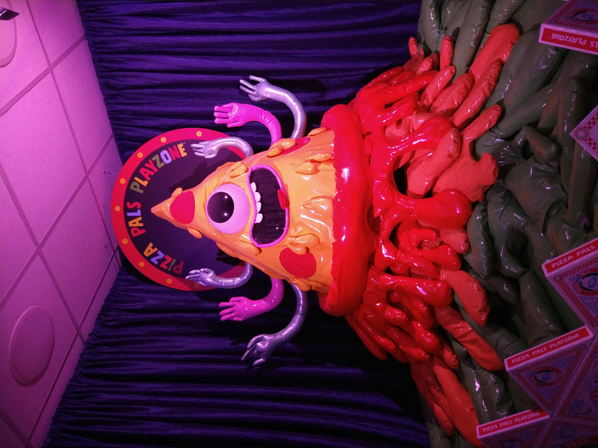
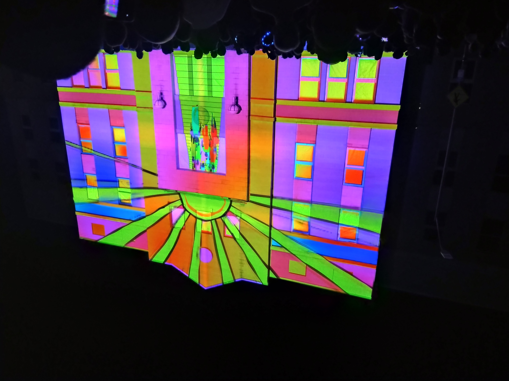
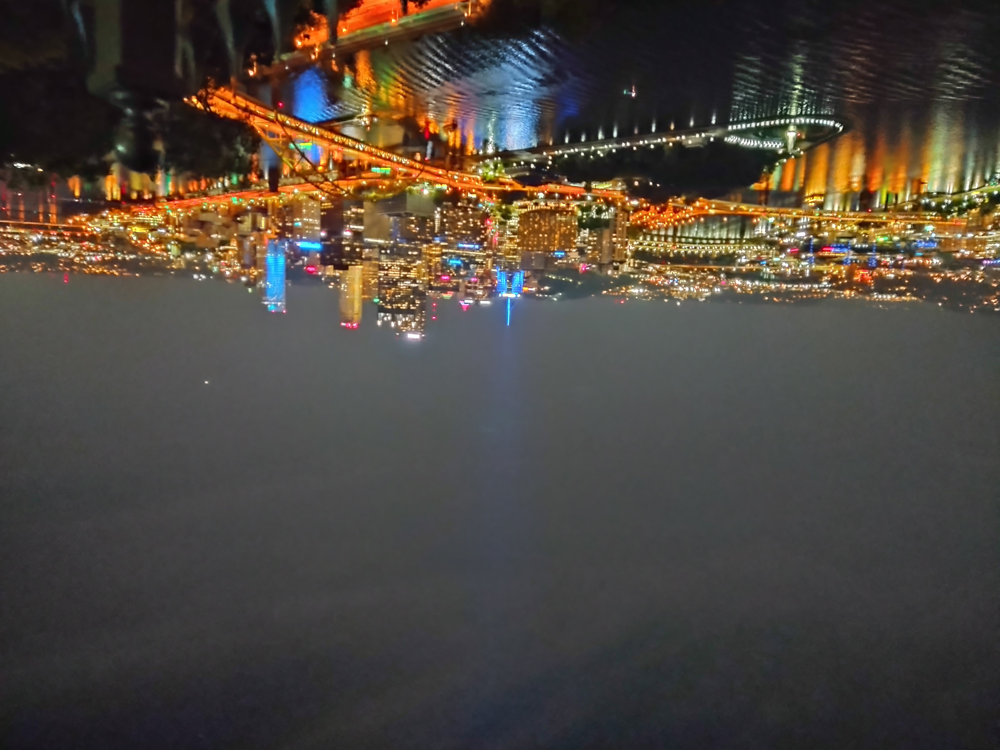

2022 has been a strange year. At the end of 2021, I expected a return to stability and normalcy with which I could chug away at meeting my personal and professional goals. Unfortunately life doesn't always go the way you wish it would, so instead I'm back at it with another year of reflecting on how things have gone:

## The Good of 2022

### Career Promotion

In January I was promoted at my job and have appreciated the opportunity to work at a title with a higher seniority and all that comes with it. I've gotten some experience with managing people and projects in this last year as well, which should serve me well with respect to my future career goals.

### Creating a "Second Brain"

This year, I came across the concept of a Second Brain after reading a book on the topic by Tiago Forte. A Second Brain (in non-self-help) terms is basically an organized digital space where any ideas, thoughts, or other information you might want to look back on in the future are stored. 

I've used OneNote since I started my current role, becoming a huge fan of its search feature in particular to find old notes. But while I enjoyed OneNote, I still wasn't using it to its fullest potential since I wasn't keeping it well-organized. I'd throw notes in wherever and hope that the search function would help me find whatever I had written down.

Now, I'm much more deliberate with the process. It took many hours to organize my OneNote but now it's much easier to find where things are located. Further, since notes are now in more logical areas, I can connect concepts together that previously I might have entirely missed out on. 

I know it sounds weird that one of my big wins this year basically amounted to being more disciplined and organizing better, but something clicked with me this year to take digital organization seriously. I firmly believe this change will pay huge dividends long-term for my personal development.

### Travel

This year I had the opportunity to travel to some different locations I hadn't been previously.

The highlight of the year's trips was one that I took to Colorado in the summer, which included visiting a zany museum in Denver called Meow Wolf:

Visiting Black Canyon National Park:

And Rocky Mountain National Park:

It was my first time being in a different time zone, a mile above sea level, visiting a US national park, and in a desert. Colorado knocked off a lot of "firsts" for me!

I also saw a light show called LUMA: 

And I visited Pittsburgh for the first time, seeing the skyline at night from the Duquesne Incline:

I'm grateful that I've been able to go so many places this year.

## The Bad of 2022

### (All The) Stressors

2022 wasn't as tranquil as I was hoping for after buying my house. 

My personal life has experienced a fair bit of turbulence this year that I wasn't anticipating. Family members have had their health deteriorate due to cancer on both sides, which has increased long-running tensions. Further, I had to reset my social life after moving, and that's taken up a lot of my time and energy. 

Professionally, my workplace (Spectrum) merged with another health system (Beaumont) and rebranded themselves as Corewell Health. There's not been any direct changes yet to my role, but mergers inherently come with additional stress. Though there's been no direct changes to my role since the promotion, I will have a new boss in early 2023 as Corewell hires a director to grow its data science capabilities. While there's a great opportunity with that transition, there's always uncertainty whenever your manager changes.

Then there's been the general stressors that are societal, such as the economy, climate change, politics, etc. I won't go into detail on those here, but living in interesting times isn't what I'd call relaxing by any means.

### Missed Goals

I was optimistic that the end of 2021 would lead to great changes that would ultimately help me reach my goals. Unfortunately, not all of these were necessarily reached in the way I was hoping for.

I didn't reach my fitness goals I had set at the end of 2021. While I didn't necessarily make things worse in the last year, I didn't progress in the way I was hoping for.

I also didn't reach my game development goals I was hoping I'd make in 2022 either. My next game has run into various creative blocks I didn't experience in my first game, and I wasn't able to flesh out the story for my game in a way I was satisfied with. 

Lastly, despite prioritizing my social life and its stability in 2022, I didn't meet my goals there. While my social situation has definitely improved compared to a year ago, I struggled with meeting people locally and relied on rekindling past friendships and acquaintanceships to rebuild my social life. That was a viable strategy that helped my situation, don't get me wrong, but I didn't meet many new people as a result. I'm hopeful that I can expand my social horizons in 2023 and be more of the friend I wish that I had growing up to others.

## Conclusion

2023 has a lot of uncertainty baked in right from the start, so I've taken that into consideration when setting goals for the year. I'll be curious to see what life has in store for me with this upcoming year! (It's already surprising enough that the Giants have something to play for in 2023, if nothing else.)