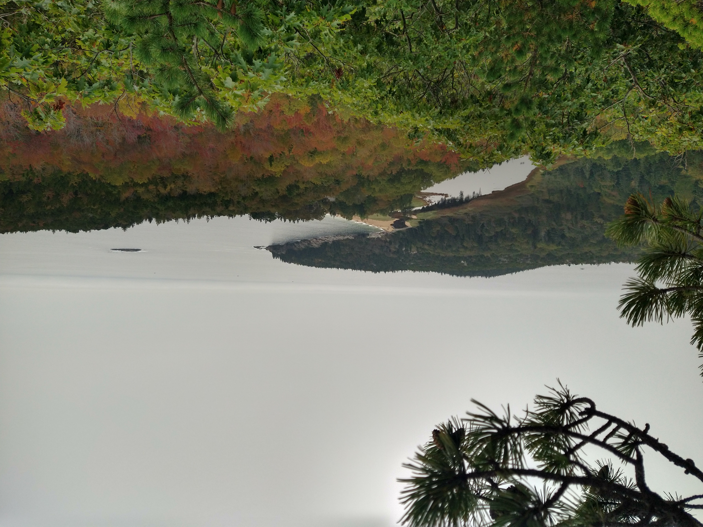

2023 was a year where I was absolutely unproductive with writing blog posts. I had a hard time feeling like I had anything useful or educational to say in a with the rapid adoption of ChatGPT. However, ChatGPT can't talk about how my life has gone, so at the very least, I can continue these blog posts!

## The Good of 2023

### More Travel Goals Met

I was able to travel quite a bit this year, including going to the following areas:

* Wisconsin
* National Parks near Las Vegas and Maine
* New Orleans

To start off, here are the national parks I managed to visit. There was a few in July, including the Grand Canyon:

Bryce Canyon National Park:

and Zion National Park:

Additionally, I was able to hit Acadia in September:

Besides national parks, I was also was able to go to New Orleans in December:

Overall, I've knocked off even more places that were on my travel bucket list in 2023, and I'm looking forward to visiting some more places in 2024.

### Finding Peace in Doing Things Alone

In June, I was lucky enough to be able to take a solo trip for a work conference. This was the first time I had ever traveled across states without knowing a single person at the location I went to (I've traveled alone in airplanes, but usually friends/family awaited me at the airport).

Getting a rental car and exploring an unfamiliar area solo was nerve-wracking, especially as there were a few anxiety-inducing situations that happened on the trip (getting attacked by birds, a deer almost running into me, and learning I get claustrophobic in caves). However, I'm glad I took advantage of the opportunity my workplace gave me and did the trip. 

I tried to take that approach into other areas of my life, including solo hiking and attending local events by myself throughout the year. These were easier to do solo than a trip to another state, and I'm slowly getting better at putting myself out there at events where I don't know another soul in attendance. I still don't *like* it, but I am building confidence in the fact that I can indeed *do* it.

### A More Optimal Financial Setup

This isn't a particularly "fun" topic, but I took another look at my financial setup and finally opened up a high-yield savings account to take advantage of high interest rates. This isn't exactly a life-altering change, but it has resulted in me making more in interest on my liquid savings, and every little bit helps as I consider my future financial goals.

## The Bad of 2023 

### Loneliness is Relentless

Unfortunately I had a family member pass early in January from cancer, which really didn't set a good tone for how 2023 was going to go. This led to some infighting amongst my extended family, which is never any fun to deal with.

Ultimately, the above was a wake-up call to a bitter truth that I needed to swallow. I grieved and accepted I won't have the family relationships that I wish I did. I'm not like the rest of my family; for example, most of them were lucky to graduate high school, yet I obtained a Master's degree. I recognize overall it's not a bad thing to be different in this situation, but I won't lie, it's easy to feel envious of others who *do* have those relationships in their life.

I also didn't make any progress in building more meaningful relationships (romantic, platonic, or otherwise) in 2023. (This feels embarrassing to type out, as this has been a goal of mine for years now.) I know it wasn't for a lack of effort, as I focused on local in-person events and Meetup groups for 2023. Unfortunately, they simply didn't pan out as I hoped. 

I'm trying to approach this disappointment with radical acceptance, telling myself that "it is what it is" and that my self-worth is not defined by the quality and/or quantity of relationships I have currently in my life. I'm also trying to cut myself some slack; most people would struggle with loneliness if they had to spend effectively two years completely isolated due to COVID, WFH, and living in a new location.

### Health Stressors

In the early months of 2023, I dealt with muscle twitching across my entire body. For a while I thought this was due to handling stress poorly, but I eventually was able to remedy the issue by upping my calcium intake (pro-tip for anyone who runs into this issue!), but when it happened near constantly for months on end prior, I was incredibly stressed out.

## Conclusion

2023 was ultimately an uneven year. I don't have a lot of faith in 2024 being much better on a macro level, especially with it being an election year in the US. Regardless, I'll focus on what I can do to make this upcoming year a more memorable and meaningful one.